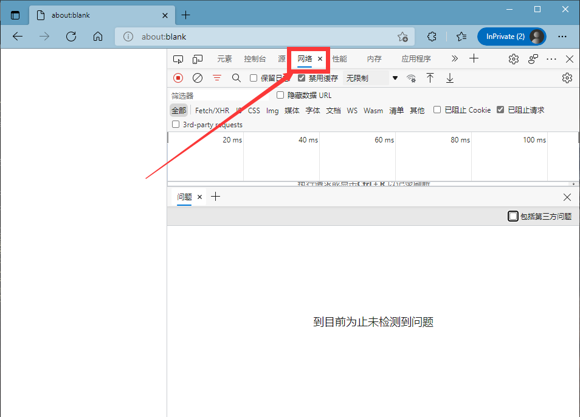
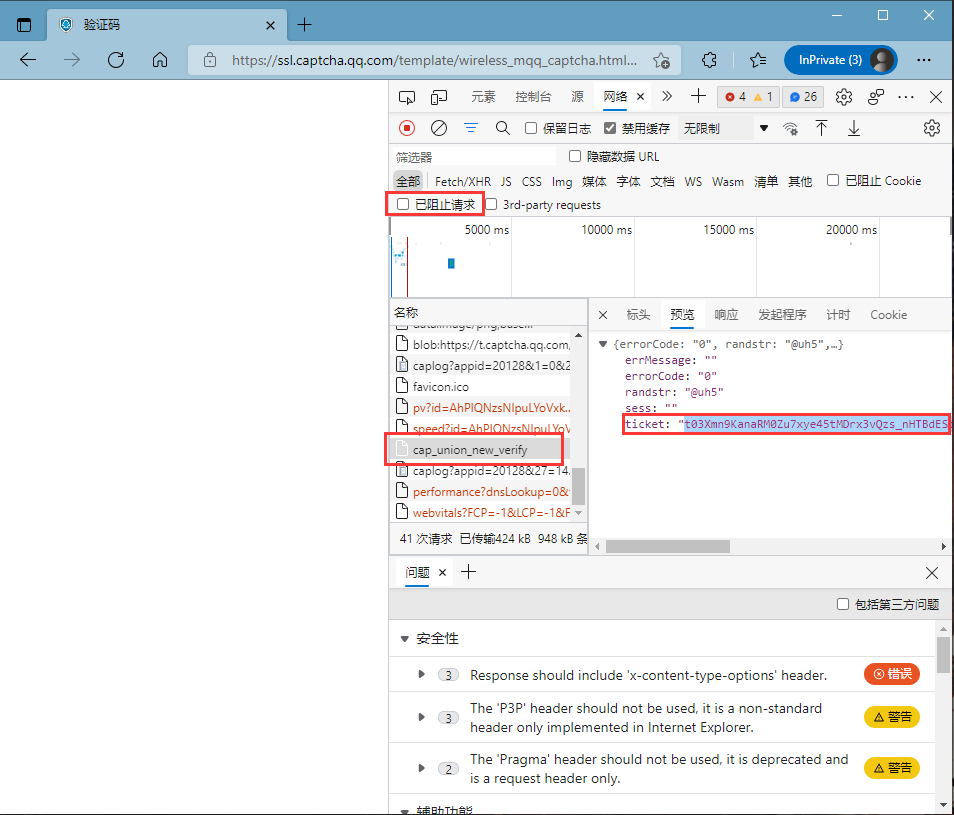
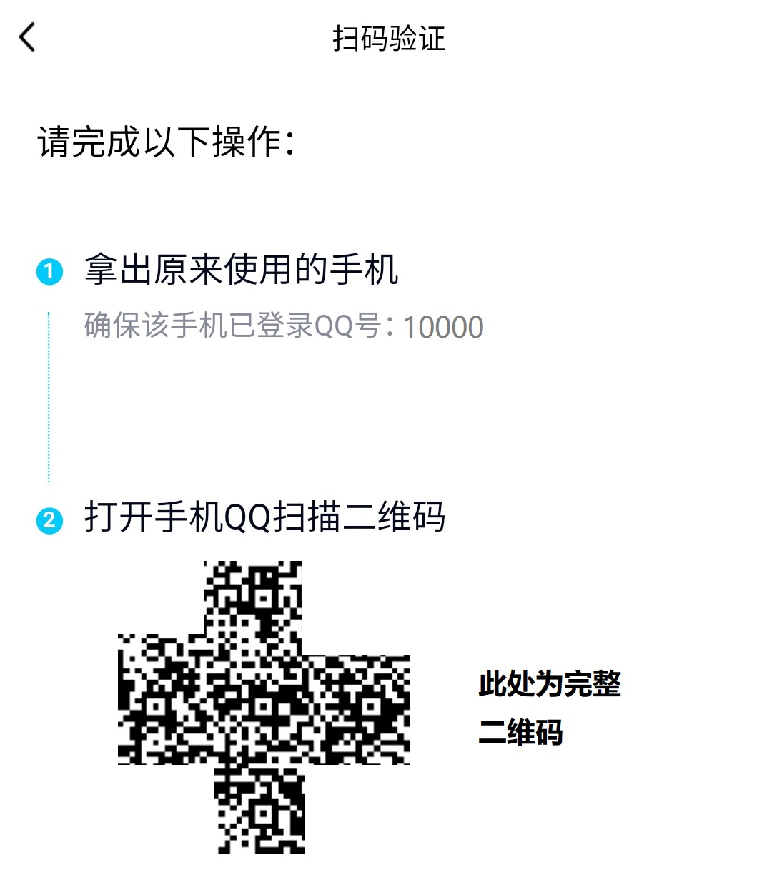

# 登录验证指南

## 文字验证码 <a id="word-captcha"></a>


由于文字验证码**大概率**会被腾讯拒绝，Mirai核心及MiraiMC可能将在未来的版本中**移除**此验证。



从MiraiMC 1.5版本起，新登录的机器人默认验证方式已变为滑块验证码。


经过多次测试，使用文字验证码登录机器人时会直接拒绝登录（“当前版本过低，请升级到QQ最新版本。”），此部分指南已移除。

## 滑块验证码 <a id="slide-captcha"></a>

当需要通过滑块验证码进行验证时，通常会看到诸如此类的警告消息（其中10000为机器人QQ号）：

```text
[12:34:56 WARN]: [MiraiMC] 当前登录的QQ（10000）需要滑动验证码验证
[12:34:56 WARN]: [MiraiMC] 请使用手机QQ打开以下链接进行验证
[12:34:56 WARN]: [MiraiMC] https://this.is.link/part
[12:34:56 WARN]: [MiraiMC] 验证完成后，请输入指令 /miraiverify slidercaptcha 10000 <ticket>
[12:34:56 WARN]: [MiraiMC] 如需取消登录，请输入指令 /miraiverify slidercaptchacancel 10000
[12:34:56 WARN]: [MiraiMC] 如需帮助，请参阅: https://wiki.miraimc.dreamvoid.ml/troubleshoot/verify-guide#slide-captcha
```

请按照以下步骤进行验证：

1. 请使用Chrome、Microsoft Edge等浏览器**打开新标签页**，然后按下**F12**键打开**开发者工具**，并切换到“**网络**”（部分浏览器为“**Network**”）选项卡。如下图（图片看不清可右键图片点击“在新标签页打开图片”）：   
2. **打开插件给出的链接**（如例子中给出的链接是`https://this.is.link/part`）；
3. **完成验证**，之后找到**`cap_union_new_verify`**，转到“**预览**”（“**Preview**”），**ticket行**的**引号**内所有内容即为**ticket值**（如果找不到`cap_union_new_verify`，请检查是否勾选了“已阻止请求”）。如下图：   
4. **回到控制台**，运行命令`/miraiverify slidercaptcha 10000 <ticket>`，将相应的值填入，完成验证。（其中10000为机器人QQ号）


如果你觉得使用开发者工具太麻烦，又或者想在没有安装Chrome等浏览器的服务器环境下验证，可以使用这个：[https://txhelper.glitch.me/](https://txhelper.glitch.me/)


## 设备锁 <a id="device-locker"></a>


一种更快捷的方式是**直接关闭设备锁**，但这会大大增加账号被盗取和被腾讯冻结的概率。


当需要验证设备锁时，通常会看到诸如此类的警告消息（其中10000为机器人QQ号）：

```text
[12:34:56 WARN]: [MiraiMC] 当前登录的QQ（10000）需要设备锁验证
[12:34:56 WARN]: [MiraiMC] 请使用手机QQ打开以下链接进行验证
[12:34:56 WARN]: [MiraiMC] https://this.is.link/part
[12:34:56 WARN]: [MiraiMC] 验证完成后，请输入指令 /miraiverify unsafedevice 10000
[12:34:56 WARN]: [MiraiMC] 如需取消登录，请输入指令 /miraiverify unsafedevicecancel 10000
[12:34:56 WARN]: [MiraiMC] 如需帮助，请参阅: https://wiki.miraimc.dreamvoid.ml/troubleshoot/verify-guide#device-locker
```

请准备好所需的物品准备验证：

* 安装有QQ、TIM且已登录机器人账号的手机
* 能够与手机进行数据互传的电脑或其他设备

请按照以下步骤进行验证：

1. 将**验证链接**（上方例子为`https://this.is.link/part`）发送至**手机**，并使用**手机QQ**打开（也可以在电脑上生成二维码让手机扫描）；
2. 选择任意方式进行验证（例如下方的步骤将选择“QQ扫码验证”完成）；
3. 如果选择“**QQ扫码验证**”，则将生成的二维码发送至电脑或其他设备（**请勿**长按扫码或使用选取本地图片识别，这没有用处），如下图：   
4. 在手机上，使用QQ的扫一扫功能扫码，并确认验证；
5. 回到控制台，此时运行命令`/miraiverify unsafedevice 10000`，完成验证。（其中10000为机器人QQ号）

